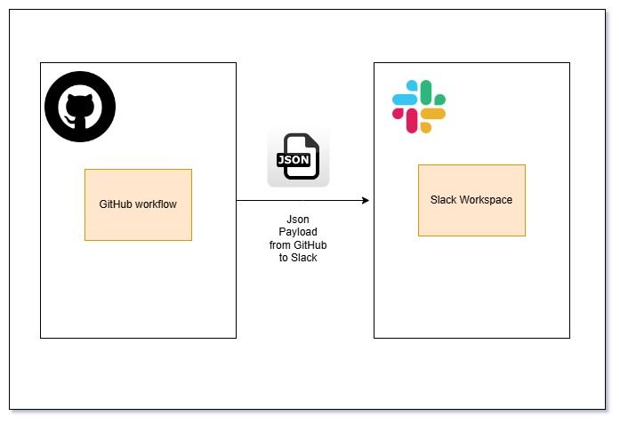

# send-notifications-to-slack-from-github
This action can be used send notifications of github workflows to slack

# Why slack

Slack is a powerful team collaboration tool that enhances communication and productivity.
It integrates with various apps and services, allowing for seamless workflow automation and centralized information sharing.
Slack's real-time messaging, file sharing, and customizable notifications keep teams connected and organized,
whether working remotely or in the office

# Prerequisites

* Ensure to have a slack account and have admin access there to create a bot.

* How to do it will be available in [prerequisites.md](prerequisites.md) file

* **Configure your slack token as a secret named `SLACK_TOKEN`**

* Pass your slack token in the workflow


# Input parameters
| Input      | Description  | Required   |
|------------|--------------|------------|    
| channel_id | Slack channel Id.| :heavy_check_mark: |
| bot_name   | slack bot name | :heavy_check_mark: |
| file_name | files to be uploadded to slack channel. more than one can be provided as a comma seperated value | :heavy_check_mark: |


# What it does



* This automation intends to use GitHub workflows to send communication to slack.

* The communications can be either files, or messages

* A GitHub workflow will be triggered with necessary input params and that can upload a file or a message to the specific Slack channel as a bot.

* The file can be of any type a json file, an image, an Excel or a xml. It Doesnt matter as long as you provide right name.

# General Usage

```markdown
    - name: send slack notification
      uses: devwithkrishna/send-notifications-to-slack-from-github@v1.0.0
      with:
        channel_id: "your channel id here" 
        bot_name: "your bot name here"
        file_name: "your file to be uploaded here. more than 1 seperate by comma"
```

# Sending multiple files to slack
```markdown
    - name: send slack notification
      uses: devwithkrishna/send-notifications-to-slack-from-github@v1.0.0
      with:
        channel_id: "C07EUSM8EVS" 
        bot_name: "demo-bot"
        file_name: "new/github-slack.jpg, data.json, data1.csv, abc/demo.txt"
```
* This will send the file named `github-slack.jpg` inside `folder new`, `data.json and sata1.csv in workspace`, 
  and `demo.txt inside abc folder` to the slack channel with id `C07EUSM8EVS` 

* Make sure you pass slack token for authentication
```markdown
env:
  SLACK_TOKEN: ${{ secrets.SLACK_TOKEN }}
```

# Reference

https://api.slack.com/methods

