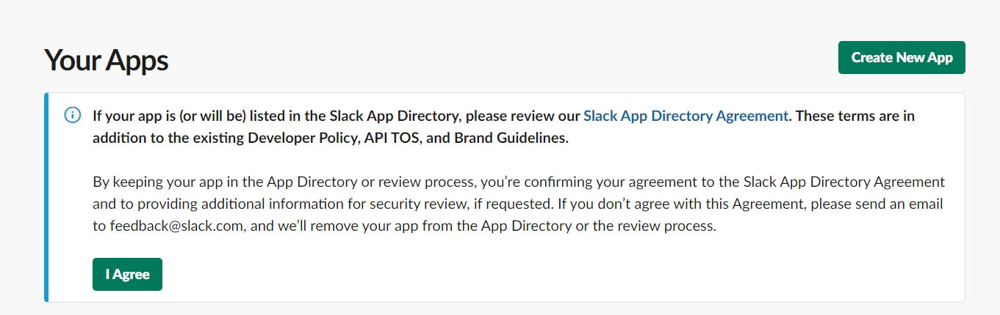
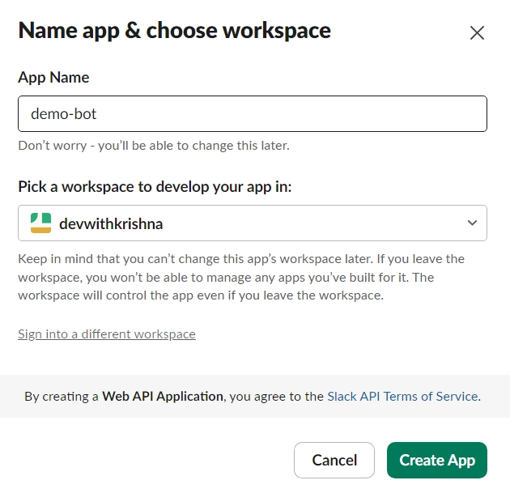
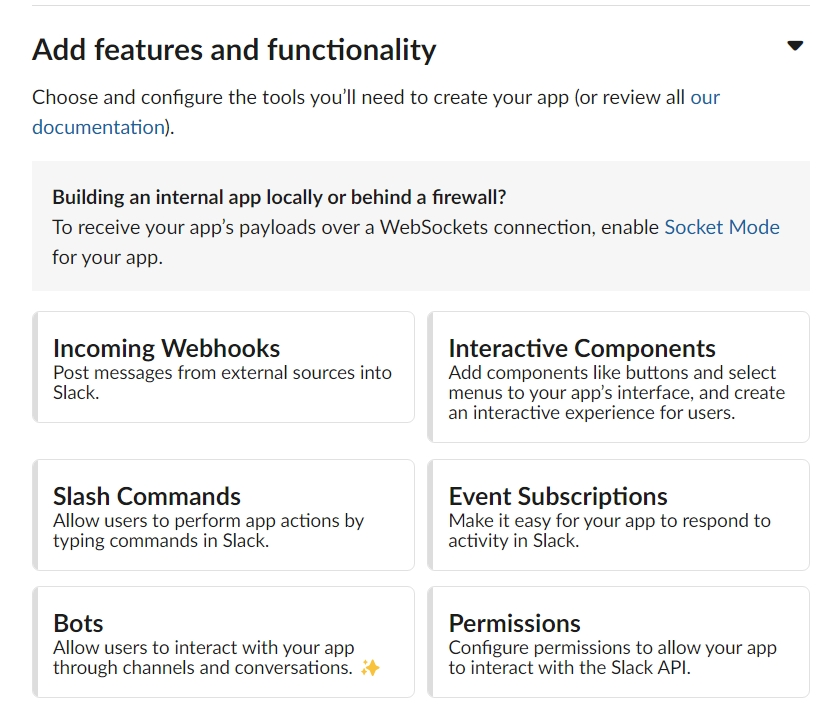
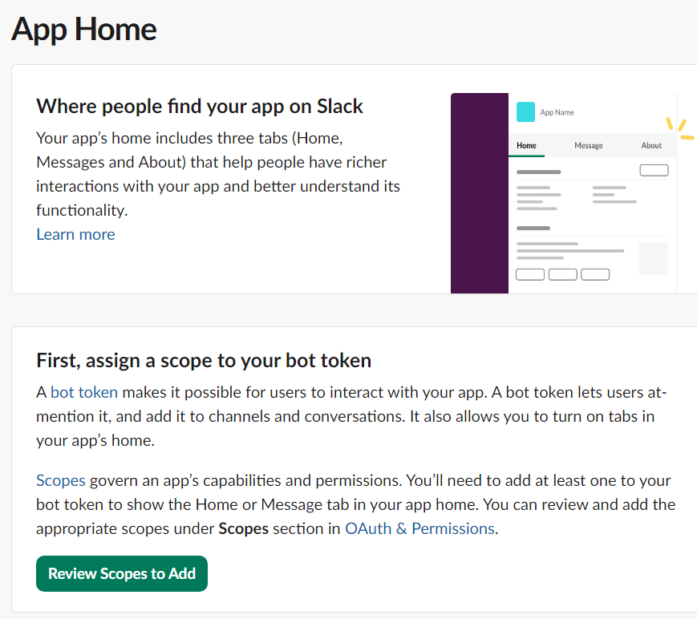
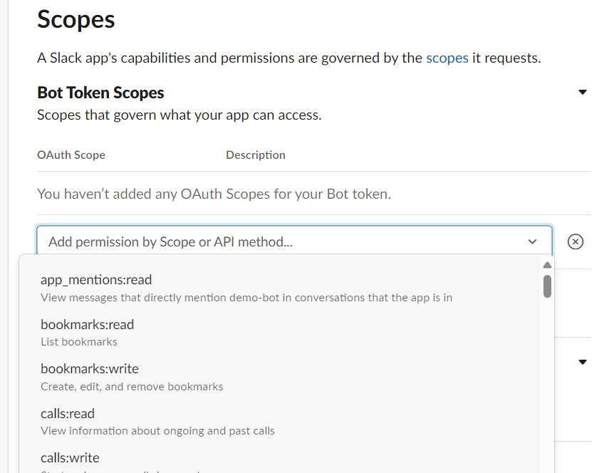
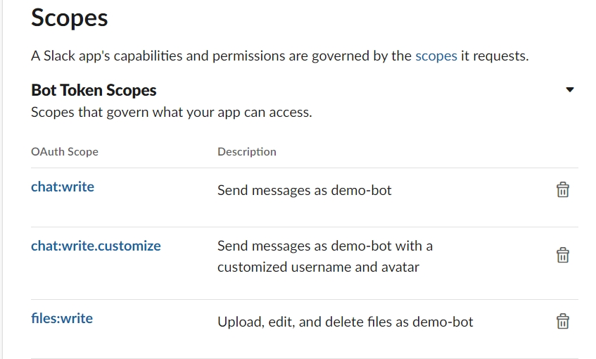
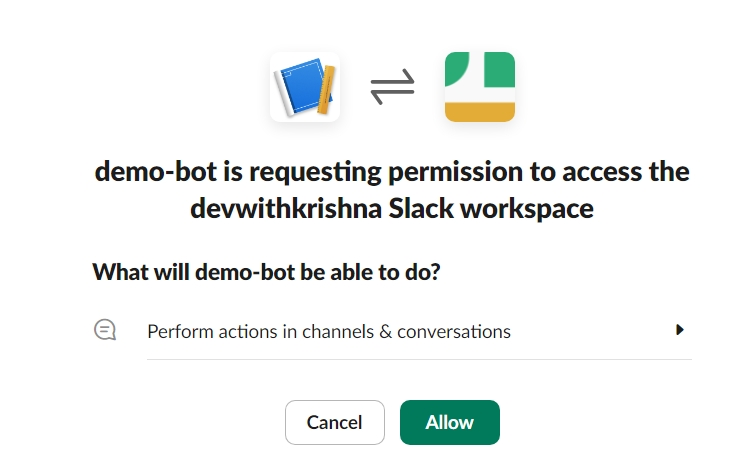
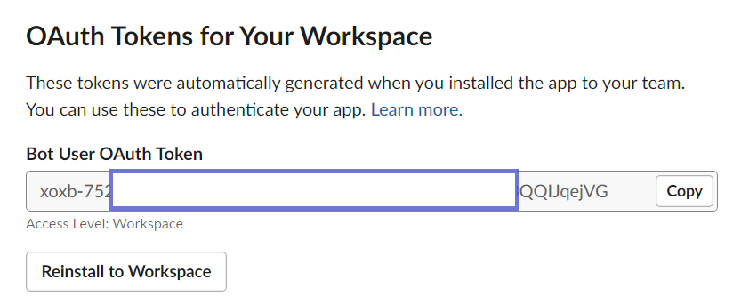

# Step 1

* if you have a slack bot you can skip this step.

* Login to your Slack account and then access this url to create a bot (app) https://api.slack.com/apps 

* Click on create a new app at the top right to create a new bot account

* Click on `create from scratch` option . Provide a `name` and select `your Slack workspace` from drop down

* click on `Create App`

 

# Step 2

* Under `Basic Information` You will see `Add features and functionality`. Click on `Bots`

* This will take you to `App Home`. Click on `review scopes to add` 

* scroll down to `scopes` section and choose below permissions under `bot token scopes`

| OAuth Scope | Description |
|-------------|-------------|
| chat:write | Send messages as demo-bot |
| chat:write.customize | Send messages as demo-bot with a customized username and avatar |
| files:write | Upload, edit, and delete files as demo-bot |

* You need to install the bot. for this scroll above under `OAuth & Permissions` click on `install to workspace`4

  

* Then provide access by clicking allow. Once installed you will see a api token which you need to use. keep it safe and secure.

* Thats the end of all Prerequisites

* When you revisit your slack under home page under apps you will see the app you just created.